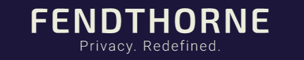

  
[](https://github.com/tterb/atomic-design-ui/blob/master/LICENSEs)

[](https://app.netlify.com/sites/epic-hawking-e816f7/deploys)


# fendThorne

**fendThorne** is a decentralised cloud storage system built for army personnel to securely **upload**, **download** and **share** files.
It uses **Arcana SDK** and **Google OAuth** under the hood for storage of files and authentication of users respectively.  

Overall Winner at **Makeathon 4.0** 

## Environment Variables

To run this project, rename the .env.example file to .env  
* Create an application from the [Arcana Dashboard](https://dashboard.arcana.network/) and copy the APP ID provided there.  

* Create an application for the OAuth flow from [Google Developer Console](https://console.cloud.google.com/) and obtain the Client ID after configuring the consent screen.
Populate the `VITE_ARCANA_APP_ID` and `VITE_GOOGLE_CLIENT_ID` with the respective IDs.  

**Note:** Remember to set the origin to [http://localhost:3000](http://localhost:3000) and the redirect url to http://localhost:3000/auth/redirect when configuring the OAuth Client ID. 


## Local Development

Clone this repository.  
```bash
    git clone https://github.com/shouryade/fendThorne.git
```

Install the required packages for the project.
```bash
  cd fendThorne
  npm install
```
Run the project using `npm run dev`.  
Navigate to http://localhost:3000.  
Since Vite supports Hot Module Reloading, you can make changes on-the-go with the localhost server up and running.

## Run using Docker
The following command would create and start the container from the image created.
`docker run -it -p 3000:3000 -d --name fendThorne shouryade/fendThorne`
    


